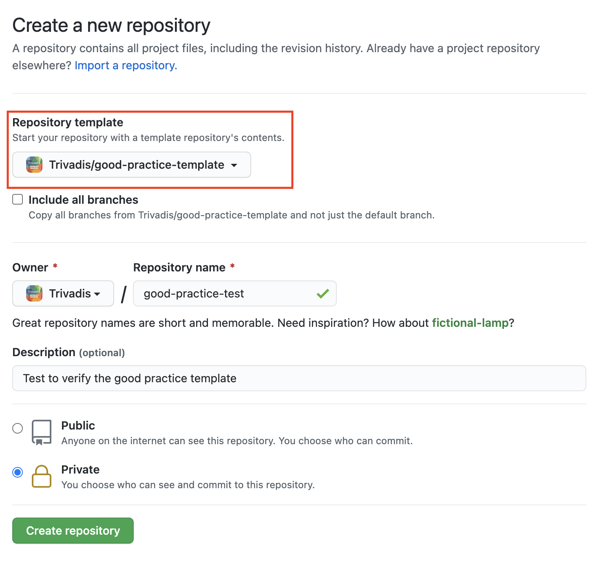

# Author and Release Guide
<!-- markdownlint-configure-file { "MD013": { "tables": false } } -->
## Document Structure

### Folders

This repository contains a couple of default folders. The language specific
folders are only a suggestion and have to be adapted or deleted accordingly. If
you add or remove language folders you also have to adjust the GitHub action
[Doc Build](.github/workflows/pandoc_builds.yml)

- [de](de) German documentation files.
- [en](en) English documentation files.
- [images](images) Images and logo files.
- [templates](templates) Various pandoc templates.

The following Markdown files are generic files describing the repository,
authoring, contributing etc. They are not related to the good practice nor will
they be used to build the good practice documentation.

- [AUTHOR_GUIDE](AUTHOR_GUIDE.md) General author's guide to *Good Practices*.
  This has to be adapted to the corresponding guideline.
- [CHANGELOG](CHANGELOG.md) Change log for the *Good Practices*.
- [CODE_OF_CONDUCT](CODE_OF_CONDUCT.md) Code of conduct for the interaction
  and cooperation within the framework of this project.
- [CHANGELOG](CHANGELOG.md) pandoc templates.

### Markdown Files

#### General Information

Each language of the good practice includes a bunch of *Markdown* files. These
files do follow a naming pattern `NxMM-Title.md` where `N` and `MM` stands for
the following:

- **N** Digit for the main chapter number.
- **M** Two digit for sorting the files within a main chapter.
- **Title** Just a title to name the file. Should be related to the content.

*It is cructial* to keep the prefix, as this is used to sort the Markdown files
during the document build process. Files with no or an other prefix will be
ignored during documentation build.

| Prefix | Chapter                                                     |
|--------|-------------------------------------------------------------|
| `0x..` | Preface, Revision History and other general doc information |
| `1x..` | Introduction, management summary, scope, etc.               |
| `2x..` | Good practice chapter 1 will be TOC number 3                |
| `3x..` | Good practice chapter 2 will be TOC number 4                |
| `Nx..` | Good practice chapter N will be TOC number N+2              |
| `9x..` | Appendix files                                              |

You can add as much files as you want. The prefix itself is not relevant for
for the TOC itself. Pandoc will create the TOC based on the headings within the
Markdown files. e.g. `#` will create a top level heading.

#### Markdown Syntax

You will find plenty of Markdown references and cheat sheets online e.g.
[/Markdown-Cheatsheet](https://github.com/adam-p/markdown-here/wiki/Markdown-Cheatsheet)

Just be aware, that the Markdown syntax is checked by a GitHub action based on
Markdown Lint
([DavidAnson/markdownlint](https://github.com/DavidAnson/markdownlint)).
Any violation of the
[rules](https://github.com/DavidAnson/markdownlint/blob/main/doc/Rules.md) will
result in an error. You either have to fix the error or add an exception to the
rule. The exception has to be added to each file. A few examples:

- Ignore rule MD013 / line length for tables

```html
<!-- markdownlint-configure-file { "MD013": { "tables": false } } -->
```

- Ignore rule MD013 / line length completely in this file

```html
<!-- markdownlint-disable MD013 -->
```

- Ignore rule MD024 / Multiple headings with the same content

```html
<!-- markdownlint-configure-file { "MD024": { "allow_different_nesting": true } } -->
```

It is recommended to add a Markdown Lint to you favorite editor like
*Visual Studio Code* and the Markdownlint by David Anson.

The latest release does support boxes in PDF generation. See
[1x10-General_Information](en/1x10-General_Information.md) for an example.

```markdown
::: note
**Note** Lorem ipsum dolor ...
:::
```

### Document Metadata

Pandoc document conversion can be configured / customized using metadata either
as a metadata block in the Markdown file itself or in a dedicated
[YAML](https://yaml.org/spec/1.2/spec.html) file. See also the
[pandoc documentation](https://pandoc.org/MANUAL.html). The workflow in this
repository is configured to use a dedicated metafile for each language. The file
is named `metadata.yml` and located in the corresponding directory (e.g.
[en/metadata.yml](en/metadata.yml) or [de/metadata.yml](de/metadata.yml))

It is strongly recommended to adjust the metadata according to the requirement
of the respective *good practice*.

## Good Practice Rules

### Numbering

Each good practice does have to have a unique ID. The current documents suggest
a good practice structure.

### Mandatory Information

The current documents suggest a good practice structure.

## Additional Language

This template does have two folders for two languages german [de](de) and
english [en](en). If necessary, one of these directories can be copied to add
another language or deleted if this language is not needed. The language
abbreviation is used as the directory name. e.g. fr, de, en etc. In order for
the documents to be created for an additional language, the GitHub action
*Doc Build* must be adapted. For the new language, corresponding steps must be
available or corresponding job must be removed. The GitHub Workflow *Doc Build*
is available in [pandoc_builds.yml](.github/workflows/pandoc_builds.yml).

As an example, the job entry for the German documentation:

```YAML
  build_de_docs:
    name: Build german documents
    runs-on: ubuntu-latest
    env:
      LANGUAGE: de
    steps:
      - name: Checkout repository
        uses: actions/checkout@v2
      - name: Populate env variables
        run: |
          echo "MD_FILES=$(printf '%s ' ${{ env.LANGUAGE }}/?x??-*.md)" >> $GITHUB_ENV
          echo "REPOSITORY_NAME=$(echo '${{ github.repository }}' | awk -F '/' '{print $2}')" >> $GITHUB_ENV
      # Build PDF using docker images oehrlis/pandoc
      - name: Build pdf document
        uses: docker://oehrlis/pandoc
        with:
          args: >-
            --pdf-engine=xelatex
            --listings
            --metadata-file=${{ env.LANGUAGE }}/metadata.yml
            --resource-path=images
            --filter pandoc-latex-environment
            --output=tvd-${{ env.REPOSITORY_NAME }}_${{ env.LANGUAGE }}.pdf ${{ env.MD_FILES }}
      # Build DOCX using docker images oehrlis/pandoc
      - name: Build docx document
        uses: docker://oehrlis/pandoc
        with:
          args: >-
            --metadata-file=${{ env.LANGUAGE }}/metadata.yml
            --listings
            --resource-path=images
            --output=tvd-${{ env.REPOSITORY_NAME }}_${{ env.LANGUAGE }}.docx ${{ env.MD_FILES }}
    
      - uses: actions/upload-artifact@master
        with:
          name: Generated Documents
          job_alias: latest
          path: tvd-${{ env.REPOSITORY_NAME }}*
```

As you can see you only have to adapt the job name `build_de_docs:` and
`name: Build german documents` as well the language variable `LANGUAGE: de`.

## Releases and Versions

### Release and Version Numbering

You find all official releases and release information on the GitHub release
page [here](https://github.com/Trivadis/good-practice-template/releases). As
well documented in the [CHANGELOG](CHANGELOG.md).

The versioning and release tags follow the
[semantic versioning](https://semver.org/). A version number is specified by
*MAJOR.MINOR.PATCH*, increase the:

- *MAJOR* version when you make incompatible API changes,
- *MINOR* version when you add functionality in a backwards compatible manner,
  AND
- *PATCH* version when you make backwards compatible bug fixes.

Additional labels for pre-release and build metadata are available as extensions
to the MAJOR.MINOR.PATCH format.

### Create a Release

New releases currently have to be build via GitHub release. Each release require
a short release note. Procedure:

- Update / Commit changes
- Update the [CHANGELOG](CHANGELOG.md) add the latest change information
- Create an new [release](https://github.com/Trivadis/good-practice-template/releases)
- Add release information based on changes e.g.
  `git log --pretty=format:%s v0.1.0...HEAD`

## Creating a new *Good Practice* Guide

This GitHub repository is defined as a template and can be used to preload a new
repository. The following figure display the dialog to create a new repository.
The red box does show how you can select the template.



- As soon the repository is create you have to update the documentation and links.
In particular replace all `Trivadis/good-practice-template` with the new
repository name.
- Add or remove language folders
- Check the GitHub actions and workflows

## Build Documentation

### Automatic Build Workflow

The GitHub repository does have several workflows defined.

| File                                                       | Workflow Name | Purpose                                              |
|------------------------------------------------------------|---------------|------------------------------------------------------|
| [mdlint.yml](./.github/workflows/mdlint.yml)               | markdown-lint | Workflow to check the Markdown Syntax.               |
| [pandoc_builds.yml](./.github/workflows/pandoc_builds.yml) | Doc Build     | Workflow with different jobs to build the documents. |

The workflow do trigger on any *push* and *pull-request* on the main branch. If
necessary it can also be triggered manually via GitHub action.

### Manual Build

#### Docker Container

Creating the documents with the help of pandoc container
[oehrlis/pandoc](https://github.com/oehrlis/pandoc_template) is the most
convenient method. Apart from having Docker installed, there are no other
dependencies. The container xxx contains all the necessary components like
pandoc, TeX, fonts, templates, etc.

- Generate a PDF document with support for awesome boxes

```bash
docker  run --rm -v "$PWD":/workdir:z oehrlis/pandoc \
--metadata-file=en/metadata.yml \
--listings --pdf-engine=xelatex \
--resource-path=images --filter pandoc-latex-environment \
--output=tvd-good-practice-template_en.pdf en/?x??-*.md
```

- Generate a PDF document without support boxes

```bash
docker  run --rm -v "$PWD":/workdir:z oehrlis/pandoc \
--metadata-file=en/metadata.yml \
--listings --pdf-engine=xelatex \
--resource-path=images \
--output=tvd-good-practice-template_en.pdf en/?x??-*.md
```

- Generate a DOCX document

```bash
docker  run --rm -v "$PWD":/workdir:z oehrlis/pandoc \
--metadata-file=en/metadata.yml \
--listings --resource-path=images \
--output=tvd-good-practice-template_en.docx en/?x??-*.md
```

- Generate a PPTX document from Chapter 2-8. This will omit preface, introduction and appendix.

```bash
docker  run --rm -v "$PWD":/workdir:z oehrlis/pandoc \
--metadata-file=en/metadata.yml \
--listings --resource-path=images \
--output=tvd-good-practice-template_en.pptx en/[1-8]x??-*.md
```

#### Local pandoc Installation

If you do have a local *pandoc* installation including LaTeX, you may also
generate the corresponding documents directly using `pandoc` via command line.
But be aware of the necessary requirements. e.g. fonts, LaTeX, templates from
[oehrlis/pandoc_template](https://github.com/oehrlis/pandoc_template) etc. In
the following examples we do expect, that you have a local copy of the templates
in the `./templates` folder.

- Generate a PDF document

```bash
pandoc --metadata-file=en/metadata.yml \
--template=$(pwd)/templates/trivadis.tex \
--listings --pdf-engine=xelatex \
--resource-path=images \
--output=tvd-good-practice-template_en.pdf en/?x??-*.md
```

- Generate a PDF document with support for awesome boxes.

```bash
pandoc --metadata-file=en/metadata.yml \
--template=$(pwd)/templates/trivadis.tex \
--listings --pdf-engine=xelatex \
--resource-path=images --filter pandoc-latex-environment \
--output=tvd-good-practice-template_en.pdf en/?x??-*.md
```

- Generate a DOCX document

```bash
pandoc --metadata-file=en/metadata.yml \
--listings --reference-doc templates/trivadis.docx \
--resource-path=images \
--output=tvd-good-practice-template_en.docx en/?x??-*.md
```

- Generate a standalone HTML document

```bash
pandoc --metadata-file=en/metadata.yml \
-s --toc --template=$(pwd)/templates/GitHub.html5 \
--resource-path=images \
--output=tvd-good-practice-template_en.html en/?x??-*.md
```

- Generate a EPUB document

```bash
pandoc --metadata-file=en/metadata.yml \
--reference-doc templates/trivadis.epub \
--resource-path=images \
--output=tvd-good-practice-template_en.epub en/?x??-*.md
```

## Further Topics

There a couple of additional topics which are not yet implemented or documented.
This includes among other the following points.

- Automatic Release Workflow see issue
  [#4](https://github.com/Trivadis/good-practice-template/issues/4)
- Generate additional formates like Word (.docx), eBooks (.epub), Power Point
  (.pptx), man pages, etc.
- Generate HTML version / GitHub Webpage using GitHub workflow see issue
  [#5](https://github.com/Trivadis/good-practice-template/issues/5)
